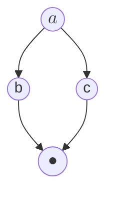
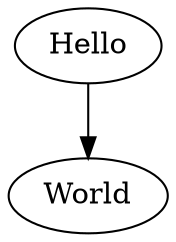

You can write content using [GitHub-flavored Markdown syntax](https://github.github.com/gfm/).

## Markdown Syntax

To serve as an example page when styling markdown based Docusaurus sites.

## Headers

# H1 - Create the best documentation

## H2 - Create the best documentation

### H3 - Create the best documentation

#### H4 - Create the best documentation

##### H5 - Create the best documentation

###### H6 - Create the best documentation

```
# H1 - Create the best documentation

## H2 - Create the best documentation

### H3 - Create the best documentation

#### H4 - Create the best documentation

##### H5 - Create the best documentation

###### H6 - Create the best documentation
```

---

## Emphasis

Emphasis, aka italics, with *asterisks* or _underscores_.

Strong emphasis, aka bold, with **asterisks** or __underscores__.

Combined emphasis with **asterisks and _underscores_**.

Strikethrough uses two tildes. ~~Scratch this.~~

```
Emphasis, aka italics, with *asterisks* or _underscores_.

Strong emphasis, aka bold, with **asterisks** or __underscores__.

Combined emphasis with **asterisks and _underscores_**.

Strikethrough uses two tildes. ~~Scratch this.~~
```

---

## Lists

1. First ordered list item
1. Another item
   * Unordered sub-list.
1. Actual numbers don't matter, just that it's a number
   1. Ordered sub-list
1. And another item.

   You can have properly indented paragraphs within list items.
   Notice the blank line above, and the leading spaces (at least one, but we'll use three here to also align the raw Markdown).

   To have a line break without a paragraph, you will need to use two trailing spaces.  
   Note that this line is separate, but within the same paragraph.  
   (This is contrary to the typical GFM line break behaviour, where trailing spaces are not required.)

1. Unordered list can use
   * asterisks
   - Or minuses
   + Or pluses

```
1. First ordered list item
1. Another item
···* Unordered sub-list.
1. Actual numbers don't matter, just that it's a number
···1. Ordered sub-list
1. And another item.

···You can have properly indented paragraphs within list items.
···Notice the blank line above, and the leading spaces (at least one, but we'll use three here to also align the raw Markdown).

···To have a line break without a paragraph, you will need to use two trailing spaces.··
···Note that this line is separate, but within the same paragraph.··
···(This is contrary to the typical GFM line break behaviour, where trailing spaces are not required.)

1. Unordered list can use
···* asterisks
···- Or minuses
···+ Or pluses
```

---

## Links

[I'm an inline-style link](https://www.google.com)

[I'm an inline-style link with title](https://www.google.com "Google's Homepage")

[I'm a reference-style link][arbitrary case-insensitive reference text]

[You can use numbers for reference-style link definitions][1]

Or leave it empty and use the [link text itself].

URLs will automatically get turned into links. http://www.example.com for example.

Some text to show that the reference links can follow later.

[arbitrary case-insensitive reference text]: https://www.mozilla.org
[1]: http://slashdot.org
[link text itself]: http://www.reddit.com

```
[I'm an inline-style link](https://www.google.com)

[I'm an inline-style link with title](https://www.google.com "Google's Homepage")

[I'm a reference-style link][arbitrary case-insensitive reference text]

[You can use numbers for reference-style link definitions][1]

Or leave it empty and use the [link text itself].

URLs will automatically get turned into links. http://www.example.com for example.

Some text to show that the reference links can follow later.

[arbitrary case-insensitive reference text]: https://www.mozilla.org
[1]: http://slashdot.org
[link text itself]: http://www.reddit.com
```

---

## Images

Here's our logo (hover to see the title text):

Inline-style: 

Reference-style: ![alt text][logo]

HTML-style (allows scaling): 

[logo]: https://bhoward.github.io/focsipedia/img/SmartFoxLogoSmall.png 'Smart fox'

```
Here's our logo (hover to see the title text):

Inline-style: 

Reference-style: ![alt text][logo]

HTML-style (allows scaling): 

[logo]: https://bhoward.github.io/focsipedia/img/SmartFoxLogoSmall.png 'Smart fox'
```
---

## Code

```javascript
var s = 'JavaScript syntax highlighting';
alert(s);
```

```python
s = "Python syntax highlighting"
print s
```

```
No language indicated, so no syntax highlighting.
But let's throw in a <b>tag</b>.
```

```js
function highlightMe() {
  console.log('This line can be highlighted!');
}
```

```reason demo
/* This is a demo of ReasonML running in your browser */
let a = 6
let b = a * 7
```

```reason edit
/* This block is editable, and can be run by pressing the button
 * or hitting Ctrl-Enter! */
let c = b == 42
```

```reason hidden
/* This block will only show its results, if any */
let f = x => if (x == 42) {
  "That's the answer!"
} else {
  "Try again"
};

print_string("Defined function f")
```

```reason fix
/* This block is also editable, but it will not automatically run
 * when the page is loaded. */
let d = /* TODO: try f(b) */
```
---

## Diagrams

Mermaid:



Graphviz:



---

## Tables

Colons can be used to align columns.

| Tables        |      Are      |   Cool |
| ------------- | :-----------: | -----: |
| col 3 is      | right-aligned | \$1600 |
| col 2 is      |   centered    |   \$12 |
| zebra stripes |   are neat    |    \$1 |

There must be at least 3 dashes separating each header cell. The outer pipes (|) are optional, and you don't need to make the raw Markdown line up prettily. You can also use inline Markdown.

Markdown | Less | Pretty
--- | --- | ---
_Still_ | `renders` | **nicely**
1 | 2 | 3

```
Colons can be used to align columns.

| Tables        |      Are      |   Cool |
| ------------- | :-----------: | -----: |
| col 3 is      | right-aligned | \$1600 |
| col 2 is      |   centered    |   \$12 |
| zebra stripes |   are neat    |    \$1 |

There must be at least 3 dashes separating each header cell. The outer pipes (|) are optional, and you don't need to make the raw Markdown line up prettily. You can also use inline Markdown.

Markdown | Less | Pretty
--- | --- | ---
_Still_ | `renders` | **nicely**
1 | 2 | 3
```

---

## Blockquotes

> Blockquotes are very handy in email to emulate reply text.
This line is part of the same quote.

Quote break.

> This is a very long line that will still be quoted properly when it wraps.
Oh boy let's keep writing to make sure this is long enough to actually wrap for everyone.
Oh, you can _put_ **Markdown** into a blockquote.

```
## Blockquotes

> Blockquotes are very handy in email to emulate reply text.
This line is part of the same quote.

Quote break.

> This is a very long line that will still be quoted properly when it wraps.
Oh boy let's keep writing to make sure this is long enough to actually wrap for everyone.
Oh, you can _put_ **Markdown** into a blockquote.
```

---

## Inline HTML

<dl>
  <dt>Definition list</dt>
  <dd>Is something people use sometimes.</dd>

  <dt>Markdown in HTML</dt>
  <dd>Does *not* work **very** well. Use HTML <em>tags</em>.</dd>
</dl>

```
<dl>
  <dt>Definition list</dt>
  <dd>Is something people use sometimes.</dd>

  <dt>Markdown in HTML</dt>
  <dd>Does *not* work **very** well. Use HTML <em>tags</em>.</dd>
</dl>
```

---

## Line Breaks

Here's a line for us to start with.

This line is separated from the one above by two newlines, so it will be a _separate paragraph_.

This line is also a separate paragraph, but...  
This line is only separated by a single newline, so it's a separate line in the _same paragraph_.

```
Here's a line for us to start with.

This line is separated from the one above by two newlines, so it will be a _separate paragraph_.

This line is also a separate paragraph, but...··
This line is only separated by a single newline, so it's a separate line in the _same paragraph_.
```
---

## Warnings, etc.

:::warning
This is a warning message. Other options include caution, note, important, and tip.
:::

:::tip Custom Title
You can include a custom title on your callout messages.
:::

```
:::warning
This is a warning message. Other options include caution, note, important, and tip.
:::

:::tip Custom Title
You can include a custom title on your callout messages.
:::
```

## Footnotes

Use brackets and a caret around the footnote marker.[^1]
The footnote marker should be a number in the proper sequence.[^2]

[^1]: Define the footnote separately, just like reference links.
[^2]: This may be a bug/misfeature in the markdown processor.

```
Use brackets and a caret around the footnote marker.[^1]
The footnote marker should be a number in the proper sequence.[^2]

[^1]: Define the footnote separately, just like reference links.
[^2]: This may be a bug/misfeature in the markdown processor.
```